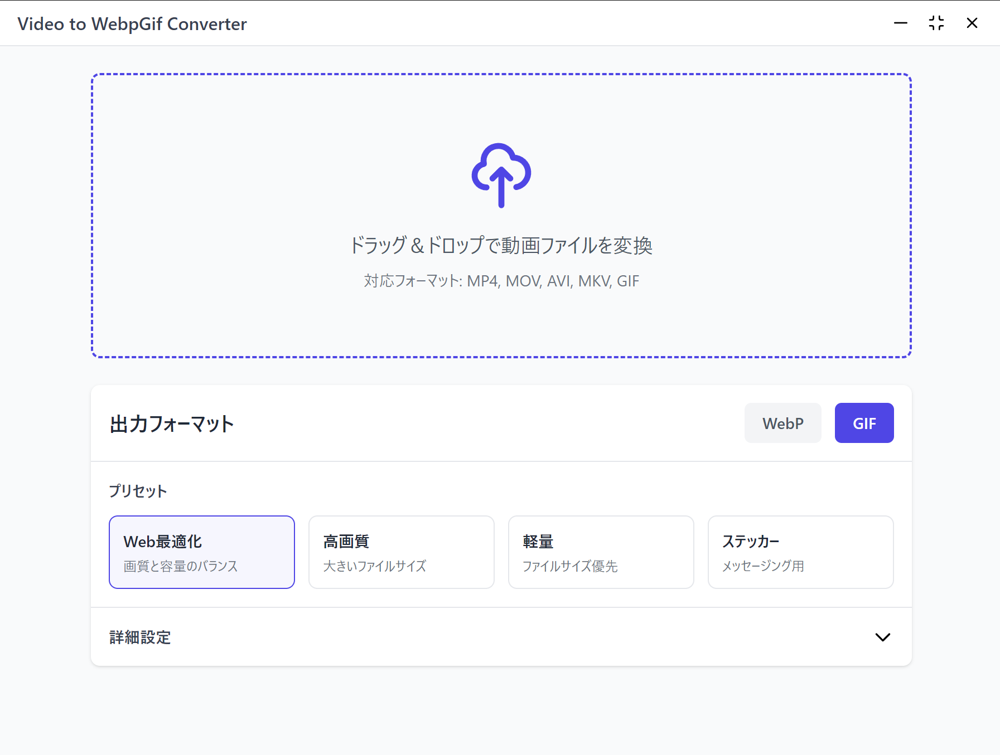

# Video to WebpGif Converter

動画ファイルをWebPまたはGIF形式に変換するシンプルなデスクトップアプリケーションです。



## 特徴

- 動画からWebPアニメーションへの変換
- 動画からGIFアニメーションへの変換
- ドラッグ＆ドロップによる簡単な操作
- 用途に応じた最適化プリセット
- カスタマイズ可能な変換設定
- モダンで使いやすいUI

## 必要要件

- Node.js 14.0.0以上
- FFmpeg（システムにインストールされ、PATHが通っていること）

## FFmpegのインストール

### Windows
1. [FFmpeg公式サイト](https://ffmpeg.org/download.html)からFFmpegをダウンロード
2. ダウンロードしたファイルを解凍
3. 解凍したフォルダ内の`bin`ディレクトリをシステム環境変数PATHに追加
4. コンピュータを再起動

### macOS
Homebrewを使用してインストール:
```bash
# Homebrewのインストール（まだの場合）
/bin/bash -c "$(curl -fsSL https://raw.githubusercontent.com/Homebrew/install/HEAD/install.sh)"

# ffmpegのインストール
brew install ffmpeg

# インストール後、以下のコマンドでffmpegが利用可能か確認
which ffmpeg
```

注意: Apple Silicon Macの場合、Homebrewのインストール先が `/opt/homebrew` になります。Intel Macの場合は `/usr/local` です。アプリケーションは両方のパスに対応しています。

### Linux (Ubuntu/Debian)
```bash
sudo apt update
sudo apt install ffmpeg
```

## インストール

```bash
# リポジトリのクローン
git clone https://github.com/Uhiyamind/video-to-webpgif-converter.git
cd video-to-webpgif-converter

# 依存関係のインストール
npm install

# アプリケーションの起動
npm start
```

## 使用方法

1. アプリケーションを起動
2. 変換したい動画ファイルをウィンドウにドラッグ＆ドロップ
3. 出力フォーマット（WebPまたはGIF）を選択
4. プリセットを選択するか、詳細設定で細かく調整
5. 変換完了後、同じディレクトリに変換されたファイルが保存されます

## 対応フォーマット

入力:
- MP4
- MOV
- AVI
- MKV
- GIF

出力:
- WebP
- GIF

## 開発

```bash
# 開発モードで起動
npm run dev

# アプリケーションのビルド
npm run build

# パッケージ化
npm run pack
```

## ライセンス

このプロジェクトは[MIT License](LICENSE)の下で公開されています。

## 注意事項

このアプリケーションはFFmpegに依存しています。FFmpegは別途インストールする必要があり、このアプリケーションには含まれていません。FFmpegのライセンスや利用規約については、[FFmpeg公式サイト](https://ffmpeg.org)を参照してください。 